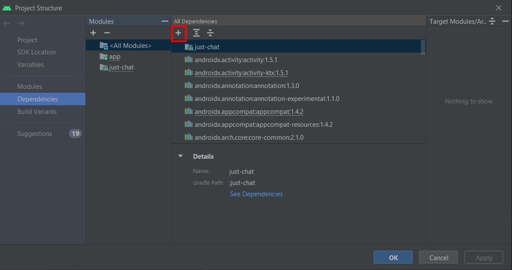
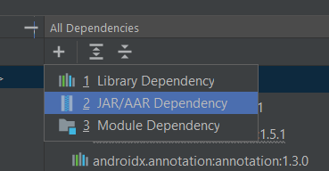
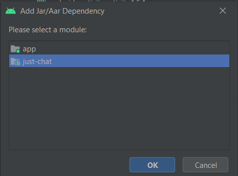

# JustChat-kotlin #

Esta es una librería la cual tiene la finalidad de abstraer la parte visual de un chat en una aplicación.<br>
Contiene tanto las funcionalidades para abrir un chat como una lista de chats.

## Índice ##
* [Información básica](#información-básica)
* [Requisitos](#requisitos)
* [Implementación](#implementación)
* [Inicialización](#inicialización)
* [Abrir lista de chats o chat individual](#abrir-lista-de-chats-o-chat-individual)
  * [Lista de chats](#lista-de-chats)
  * [Chat individual](#chat-individual)
* [Implementaciones necesarias para el correcto funcionamiento de JustChat](#implementaciones-necesarias-para-el-correcto-funcionamiento-de-justchat)
  * [Obtener una lista de chats](#obtener-una-lista-de-chats)
  * [Obtener los mensajes de un chat](#obtener-los-mensajes-de-un-chat)
  * [Obtener información de un usuario](#obtener-información-de-un-usuario)
  * [Envío de un mensaje](#envío-de-un-mensaje)
  * [Flujo para recibir mensajes en tiempo real](#flujo-para-recibir-mensajes-en-tiempo-real)
* [Notificaciones (beta)](#notificaciones-beta)
  * [Servicio de notificaciones](#servicio-de-notificaciones)
  * [Abrir chat desde una notificación](#abrir-chat-desde-una-notificación)

## Información básica ##

* Esta es una librería la cual tiene la finalidad de abstraer la parte visual de un chat en una aplicación.<br>
  En esta guía se explicará la configuración básica para implementar e inicializar la librería.
* Versión: 1.0

## Requisitos ##
* Android Studio 4.0 o superior.
* Android 6.0 o superior.

## Implementación ##

* Descargar la librería, y desde Android Studio pulsar en <b>File > Project Structure > Dependencies > All Dependencies > + > JAR/AAR Dependency > 'Seleccionar la librería JustChat'</b><br><br>
<br>
<br>
<br>
* Implementarla en el <b>gradle.app</b>:
<pre>implementation project(path: ':just-chat')</pre>
Para más información visita el siguiente <a href="https://developer.android.com/studio/projects/android-library?hl=es-419#psd-add-library-dependency" target="_blank">enlace</a>.

## Inicialización ##

Para inicializar la librería JustChat, utilizaremos la clase <b>JustChat</b> de la librería de la siguiente forma:
<pre><code>
JustChat.Builder()
    .provideContext(this)
    .setUserId(firebaseAuth.currentUser?.uid)
    .setEventsImplementation(events)
    .build()
</code></pre>

Donde <code>setUserId()</code> le pasaremos el id del usuario actual.

En <code>justChat.setEventsImplementation()</code> le pasaremos la implementación con las llamadas que pide la librería y que son necesarios para funcionar.<br><br><b>IMPORTANTE</b>: Esta implementación tiene que extender de la interfaz <code>Events</code> de la librería:
```kotlin
class EventsImpl @Inject constructor(
    private val context: Context,
    private val eventsUseCase: EventsUseCase,
    private val notificationsUseCase: NotificationsUseCase
) : Events {

    override fun initFlowGetChats(userId: String): Flow<MutableList<Chat>> {
        return eventsUseCase.getChats(context.isNetworkAvailable, userId)
    }

    override fun getChat(userId: String, chatId: String): Flow<Chat> {
        return eventsUseCase.getChat(context.isNetworkAvailable, userId, chatId)
    }

    override fun getGroups(userId: String): Flow<MutableList<Group>> {
        return eventsUseCase.getGroups(context.isNetworkAvailable, userId)
    }

    override fun getChatMessages(
        userId: String,
        chatId: String,
        page: Int
    ): Flow<MutableList<ChatMessageItem>> {
        return eventsUseCase.getChatMessages(context.isNetworkAvailable, userId, chatId, page)
    }

    override fun getCurrentUser(userId: String): Flow<UserData> {
        return eventsUseCase.getCurrentUser(context.isNetworkAvailable, userId)
    }

    override fun sendMessage(
        chatInfo: ChatInfo,
        message: ChatMessageItem
    ): Flow<ResultInfo> {
        return eventsUseCase.sendMessage(context.isNetworkAvailable, chatInfo, message)
    }

    override fun initFlowReceiveMessage(
        userId: String,
        chatId: String
    ): Flow<ChatMessageItem> {
        return eventsUseCase.initFlowReceiveMessage(context.isNetworkAvailable, userId, chatId)
    }

    override suspend fun sendNotification(
        userId: String,
        chat: Chat?,
        message: String?
    ) {
        notificationsUseCase.sendNotification(notification)
    }
}
```

## Abrir lista de chats o chat individual ##
JustChat te permite abrir tanto una lista de chats del propio usuario, como un chat individual.

### Lista de chats ###
Para abrir un chat individual, utilizaremos el método <code>justChat.openChatLists()</code> de la librería.

### Chat individual ###
Si por el contrario quieres abrir un chat individual, tendrás que utilizar el método <code>justChat.openChat(chatId)</code>.<br>
Este método debe lanzarse dentro de una corutina y puede lanzar una excepción tipo <code>ChatNotFound</code> ya que puede ocurrir que ese chat no exista.
<pre><code>lifecycleScope.launch(Dispatchers.IO) {
    justChat.openChat("RUEUW483832NDNDA")
}</code></pre>

<b>Nota: La función de grupos aún está en fase beta.</b>

## Implementaciones necesarias para el correcto funcionamiento de JustChat ##
Los siguientes métodos requieren de una implementación, en caso contrario la librería no funcionará.

### Obtener una lista de chats ###
JustChat automáticamente crea un flujo el cual permite estar a la escucha de nuevos chats <code>initFlowGetChats(userId)</code>, este flujo se utiliza por defecto de la lista de chats, y puedes implementarlo muy fácilmente como en el siguiente ejemplo:
<pre><code>
override fun initFlowGetChats(userId: String): Flow<MutableList<Chat>> {
    return eventsUseCase.getChats(context.isNetworkAvailable, userId)
}
</code></pre>

### Obtener los mensajes de un chat ###
Para poder chatear con un usuario primero se tienen que cargar los mensajes del propio chat, y para ello JustChat necesitará la implementación del método 
<code>fun getChatMessages(userId, chatId, page)</code>. Se puede implementar muy fácilmente como en el siguiente ejemplo:
<pre><code>
override fun getChatMessages(
    userId: String,
    chatId: String,
    page: Int
): Flow<MutableList<ChatMessageItem>> {
    return eventsUseCase.getChatMessages(context.isNetworkAvailable, userId, chatId, page)
}
</code></pre>

### Obtener información de un usuario ###
Para obtener información de un usuario, sea para mostrar sus datos o para enviar una notificación, se necesitará la implementación del método 
<code>getCurrentUser(userId)</code>, un ejemplo de implementación sería el siguiente:
<pre><code>
override fun getCurrentUser(userId: String): Flow<UserData> {
    return eventsUseCase.getCurrentUser(context.isNetworkAvailable, userId)
}
</code></pre>

### Envío de un mensaje ###
Como toda app o librería de chat, se va a necesitar de un método para enviar los mensajes, para ello se utilizará el método 
<code>sendMessage(chatInfo, message)</code> la cual se puede implementar de la siguiente forma:
<pre><code>
override fun sendMessage(
    chatInfo: ChatInfo,
    message: ChatMessageItem
): Flow<ResultInfo> {
    return eventsUseCase.sendMessage(context.isNetworkAvailable, chatInfo, message)
}
</code></pre>

### Flujo para recibir mensajes en tiempo real ###
Para que el chat tenga un correcto funcionamiento, tiene que haber un flujo de datos contínuo que se encargue de estar a la escucha de si hay nuevos mensajes <code>initFlowReceiveMessage(userId, chatId)</code>. JustChat necesita esta implementación para que desde la pantalla de chat se obtengan los nuevos mensajes:
<pre><code>
override fun initFlowReceiveMessage(
    userId: String,
    chatId: String
): Flow<ChatMessageItem> {
    return eventsUseCase.initFlowReceiveMessage(context.isNetworkAvailable, userId, chatId)
}
</code></pre>

## Notificaciones (beta) ##
La siguiente funcionalidad se puede implementar por completo desde back o desde la app, para implementarlo desde la app sigue los siguientes pasos.
<br><b>Nota</b>: Se ha utilizado Firebase como método estándar para enviar y recibir notificaciones.<br><br>
Si queremos mostrar las notificaciones se tendrá que utilizar las mismas preferencias que la librería:

<pre><code>
@Singleton
@Provides
fun provideSharedPreferences(@ApplicationContext context: Context): SharedPreferences? {
    return context.getSharedPreferences(PREFERENCES, Context.MODE_PRIVATE)
}
</code></pre>

Donde <code>PREFERENCES</code> viene de la propia librería.<br><br>
Y en la implementación de la intefaz mencionada con anterioridad <code>Events</code>, se implementará la notificación de la siguiente forma:

<pre><code>
override suspend fun sendNotification(
    userId: String,
    chat: Chat?,
    message: String?
) {
    eventsUseCase.getCurrentUser(context.isNetworkAvailable, userId).collect {
        val dataNotification = DataNotification(
            chatId = chat?.id.toString(),
            chatDestinationUserName = it.userName.toString(),
            chatDestinationUserId = it.userId.toString(),
            chatDestinationUserImage = it.userPhoto.toString(),
            destinationUserDeviceToken = it.userDeviceToken.toString(),
            chatMessage = message.toString()
        )
        val notification = Notification(
            to = chat?.userDeviceToken.toString(),
            data = dataNotification,
            priority = 10
        )
        notificationsUseCase.sendNotification(notification)
    }
}
</code></pre>
La forma anterior se usará si se quiere hacer una llamada a Firebase para enviar la notificación a 'x' dispositivo. En caso de ir por back, no haría falta tal implementación.

### Servicio de notificaciones ###
Para el servicio de notificaciones se puede implementar de la siguiente forma y teniendo en cuenta de usar siempre las preferencias de la librería:

<pre><code>
class NotificationService : FirebaseMessagingService() {

    override fun onNewToken(token: String) {}

    override fun onMessageReceived(message: RemoteMessage) {
        val preferences = applicationContext.getSharedPreferences(PREFERENCES, MODE_PRIVATE)
        val chatId = message.data["chat_id"]
        val chatIdPreferences = preferences.getString(CHAT_ID_PREFERENCES, "")
        if (chatId == chatIdPreferences) {
            return
        } else {
            createNotification(message)
        }
    }

    private fun createNotification(message: RemoteMessage) {
        val chatId = message.data["chat_id"]
        val chatMessage = message.data["chat_message"]
        val chatDestinationUserName = message.data["chat_destination_user_name"]
        val chatDestinationUserId = message.data["chat_destination_user_id"]
        val chatDestinationUserImage = message.data["chat_destination_user_image"]
        val chatDestinationUserDeviceToken = message.data["destination_user_device_token"]

        val chat = Chat().apply {
            id = chatId
            name = chatDestinationUserName
            otherUserId = chatDestinationUserId
            otherUserImage = chatDestinationUserImage
            userDeviceToken = chatDestinationUserDeviceToken
        }

        val intent = Intent(applicationContext, ChatActivity::class.java).apply {
            putExtra(Constants.CHAT, chat)
        }

        val notificationManager = getSystemService(Context.NOTIFICATION_SERVICE) as NotificationManager

         val notificationBuilder: NotificationCompat.Builder =
            NotificationCompat.Builder(this, CHANNEL_ID)
                .setSmallIcon(R.drawable.bell)
                .setLargeIcon(largeIcon)
                .setContentTitle(chatDestinationUserName)
                .setContentText(chatMessage)
                .setAutoCancel(true)
                .setSound(notificationSoundUri)
                .setContentIntent(pendingIntent)

        notificationManager.notify(notificationId, notificationBuilder.build())
    }

    override fun onMessageSent(msgId: String) {}
}
</code></pre>

### Abrir chat desde una notificación ###
#open-chat-from-notification
Para abrir un chat desde una notificación, tendremos que obtener los datos del propio chat desde la notificación, y crear un objeto <code>Chat</code> proporcionado por la librería:
<pre><code>
val chatId = message.data["chat_id"]
val chatMessage = message.data["chat_message"]
val chatDestinationUserName = message.data["chat_destination_user_name"]
val chatDestinationUserId = message.data["chat_destination_user_id"]
val chatDestinationUserImage = message.data["chat_destination_user_image"]
val chatDestinationUserDeviceToken = message.data["destination_user_device_token"]

val chat = Chat().apply {
    id = chatId
    name = chatDestinationUserName
    otherUserId = chatDestinationUserId
    otherUserImage = chatDestinationUserImage
    userDeviceToken = chatDestinationUserDeviceToken
}
</code></pre>

Posteriormente utilizando la constante <code>CHAT</code> proporcionada por la librería, abriremos la pantalla de <code>ChatActivity</code> porporcionada también por la librería, pasándole el chat creado en el paso anterior:
<pre><code>
Intent(applicationContext, ChatActivity::class.java).apply {
    putExtra(Constants.CHAT, chat)
}
</code></pre>